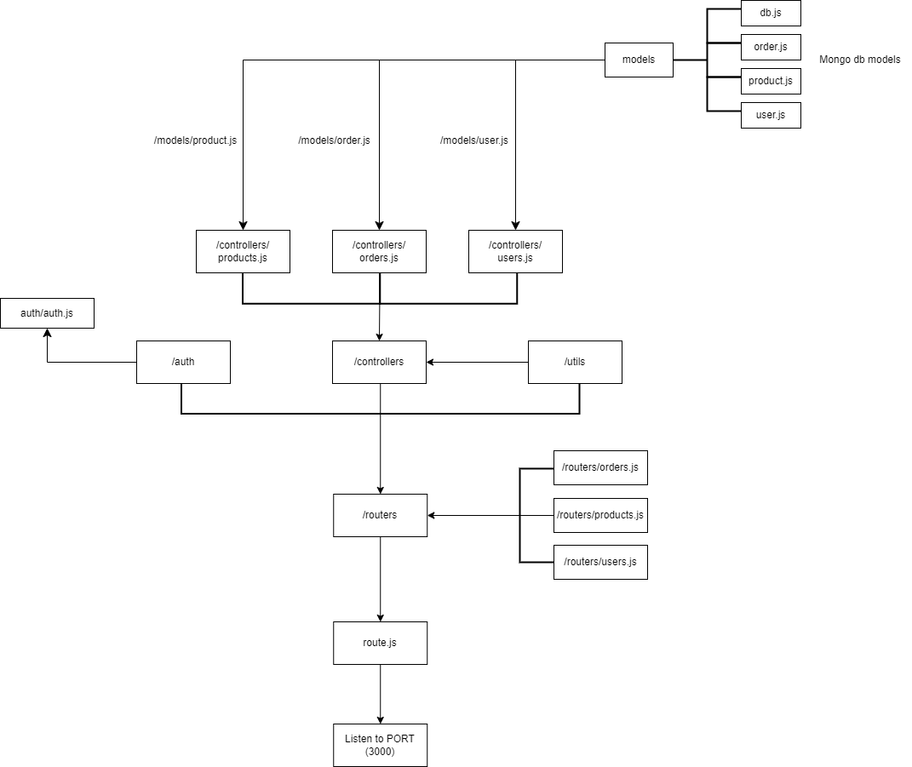
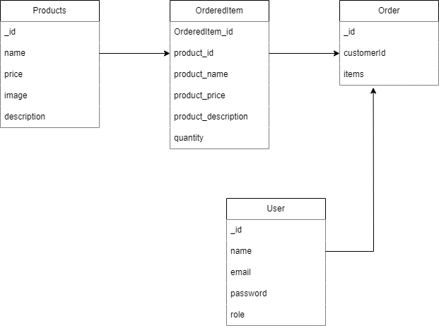
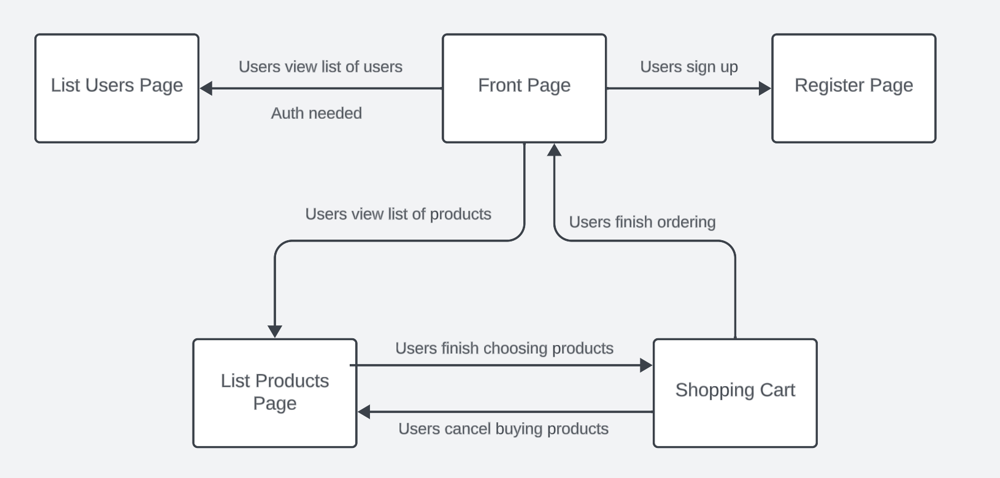

# Welcome to your group's Web Development 1 group work repository

# WebDev1 group work assignment, rounds 8-11

What should be in this document is detailed in the 11th exercise round assignment document in Google Docs. "Group" and "Tests and documentation" are shown below as examples and to give a starting point for your documentation work.

# Group 

Member1:  Cao Xuan An, an.cao@tuni.fi, 151454314, 
resposible for: 40% of group works

Member2:  Hoang Vu Hieu, hieu.hoang@tuni.fi, 151389997, 
resposible for: 30% of group works

Member3:  Nguyen Quang Minh, minh.q.nguyen@tuni.fi, 151395363, 
resposible for: 30% of group works

......

## Project structure
<b> Structure <b>

<b> Models <b>

## Pages and navigation

## Data models

<b> User <b>

| Field | Type | Description |
| --- | --- | --- |
| _id | string | ID of user account |
| name | string | Name of user |
| email | string | Email of user account |
| password | string | Password of user account |
| role | string | Role of user (customer/admin) |

<b> Product <b>

| Field | Type | Description |
| --- | --- | --- |
| _id | string | ID of product |
| name | string | Name of product |
| price | float | Price of product |
| image | string | URL of product image |
| description | string | Description of product |

<b> Order <b>

| Field | Type | Description | Relationship |
| --- | --- | --- | --- |
| _id | string | ID of product | |
| customerId | string | ID of customer who placed the order | Reference to <b>Customer<b> model |
| items | Array< OrderedItem > | List of ordered items | Reference to the <b>Ordered Item<b> model |

<b> OrderedItem <b>

| Field | Type | Description | Relationship |
| --- | --- | --- | --- |
| _id | string | ID of product | |
| productId | Product | Ordered product | Reference to <b>Product<b> model |
| quantity | int | Number of items ordered | |

## Security concerns

<b>There are some cyber crime our web can meet:</b>
* Cross-Site Scripting (XSS) 
* Session hijacking
* SQL Injection
* Directory traversal
  
<b>Because our web has a submission block for user login,  our cookies is not well protected & our URL did not encode yet.
We can prevent those by:</b>

* We strictly validate user input when login
* We using HTTPS instead of HTTP
* Urlencode our URL

## Tests and documentation

| id   |      GitLab issues                                                                    |  Responsible Person | 
|------|:--------------------------------------------------------------------------------------|:----------------|
|  1   |  [Implement CRUD for products in `./controllers/products.js`](https://course-gitlab.tuni.fi/webdev1-fall-2023-groupwork/webdev1-fall2023-group061/-/issues/13) | Hieu Hoang |
|  2   |  [Implement CRUD for orders in `./controllers/orders.js`](https://course-gitlab.tuni.fi/webdev1-fall-2023-groupwork/webdev1-fall2023-group061/-/issues/14) | Minh Nguyen |
|  3   |  [Update frontend to match products and orders API](https://course-gitlab.tuni.fi/webdev1-fall-2023-groupwork/webdev1-fall2023-group061/-/issues/17) | An Cao |
|  4   |  [Refactor handleRequest() function in `./routes.js`](https://course-gitlab.tuni.fi/webdev1-fall-2023-groupwork/webdev1-fall2023-group061/-/issues/11) | An Cao |
|  5   |  [Write project plan and description in README (Part 1-2)](https://course-gitlab.tuni.fi/webdev1-fall-2023-groupwork/webdev1-fall2023-group061/-/issues/20) | Minh Nguyen |
|  6   |  [Write project plan and description in README (Part 3-4)](https://course-gitlab.tuni.fi/webdev1-fall-2023-groupwork/webdev1-fall2023-group061/-/issues/21) | An Cao |
|  7   |  [Write project plan and description in README (Part 5-7)](https://course-gitlab.tuni.fi/webdev1-fall-2023-groupwork/webdev1-fall2023-group061/-/issues/22) | Hieu Hoang |
|  8   |  [Implement data models for products and orders](https://course-gitlab.tuni.fi/webdev1-fall-2023-groupwork/webdev1-fall2023-group061/-/issues/12) | An Cao |

## Finalization
<b>Learning from project</b>
* Construction of simple end-to-end applications
* Basics understanding of browser: HTML, CSS, JS, DOM
* Basic understanding of HTTP servers
* Creating Dynamic web applications
* HTTP sessions
* Handling of HTTP requests
* Architecture insights
* User authentication technologies
* Dynamic DOM programming from JavaScript

<b>Improving later</b>
* Using a different authentication method
* Having a payment page when users place an order in the shopping cart
* When login in as a customer role, the register page and user page do not show
